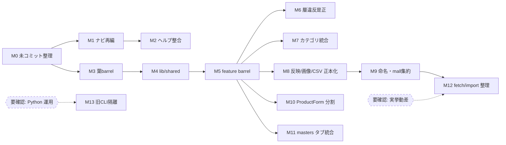

# 05. 移行計画（ステップ6 ／ 最終出力8・9・10）

方針: **1機能ずつ・小PR・ロールバック可能**。依存が少なくリスクの低いものから。**UX変更（ナビ）と構造変更（lib/コンポーネント）を混ぜない**。各段階に完了条件とロールバックを付す。コード変更は本監査の対象外＝ここは実施順の設計。

前提原則（全段階共通）:
- URL・API パス/メソッド/レスポンス・`products.extra` JSONB 契約・CSV列/エンコーディングを**変えない**（変える必要が出たら中止して再設計）。
- 各PRは **1機能移動のみ**。無関係変更を混ぜない。
- 移動前に characterization テストを**新規作成**（既存テスト改変は禁止）。移動後も vitest 緑＋該当E2E 緑。
- ロールバック = 当該PRの `git revert`（互換 re-export を残すため呼び出し元は壊れない）。

## 6.1 段階一覧（順序＝リスク低→高）

| # | 段階 | 種別 | 主対象 | 依存/前提 | リスク |
|---|---|---|---|---|---|
| M0 | 未コミット整理 | 衛生 | `proxy.ts` コミット、`middleware.ts` 削除確定、未コミット新機能の確定 | なし | 低 |
| M1 | ナビ再グルーピング | UX | `SideNav.tsx`（6グループ化）、ラベル修正 | なし | 低 |
| M2 | ヘルプ整合 | UX | `help/page.tsx` に rule-audit/bulk-images 追加、settings 明記 | M1 | 低 |
| M3 | 葉モジュール barrel | 構造 | `rakuten/ shopify/ ne-master/ image/ supabase/ history/ template/ autosave/` に `index.ts` | なし | 低 |
| M4 | `lib/shared/` 新設 | 構造 | `schema.ts`・`utils.ts` を re-export 昇格 | M3 | 中 |
| M5 | feature barrel | 構造 | `product/ converters/ register/ migrate/ rule-audit/ csv/ preview/` に `index.ts`＋import差替 | M4 | 中 |
| M6 | 層違反是正 | 構造 | `MigratePanel` の mall 直import を barrel 経由へ | M5 | 低 |
| M7 | カテゴリ支援統合(D1) | 構造 | `category-assist/autofill/mapping` → `lib/product/category/` | M5 | 中 |
| M8 | 反映/画像/CSV ロジック正本化(D2) | 構造 | `lib/register`・`lib/image`・`lib/csv` を単品/一括の唯一の正本に | M5 | 中〜高 |
| M9 | 命名4動詞・mall物理集約 | 構造 | `*-item-parser→parse` 等、`lib/malls/` へ移動 | M5,M8 | 中 |
| M10 | ProductForm 分割 | 構造 | `ProductForm.tsx`(1223) を section 別へ、`whiteBgUploadListeners` 明示化 | M5 | 中〜高 |
| M11 | masters タブ統合(U7) | UX/構造 | `/masters` と `/masters/related` を1画面タブ化（両URL維持） | M5 | 中 |
| M12 | fetch/import 整理(D3) | 構造 | 実挙動差の確認後、共通パーサ化 | M9 | 中（要確認先行） |
| M13 | 旧Python CLI 隔離 | 廃止 | `src/product_register/` 等を `legacy/` へ or 削除 | 運用ヒアリング | 中 |

### 段階の依存関係（DAG）

## 6.2 各段階の詳細（目的・作業・完了条件・ロールバック）

### M0 未コミット整理
- 目的: 現状のスナップショットを健全化（新機能・改称を確定）。
- 作業: `proxy.ts` を追跡・コミット、`middleware.ts` の削除を確定、`rule-audit`/`codex-normalize`/`research-import` を意図確認の上コミット。
- 完了条件: `git status` がクリーン。未ログインリダイレクトE2Eが緑（`proxy.ts` 有効を確認）。
- ロールバック: コミット単位で revert。

### M1 ナビ再グルーピング
- 目的: 15フラット→6グループ（03-4.2）。ラベル「商品編集」→「新規作成」。
- 作業: `components/nav/SideNav.tsx` の `items` を見出し付き階層に。URL は不変。
- 完了条件: 全ルートへ到達可能（ナビ存在E2E 緑）。既存URL不変。
- ロールバック: 1ファイル revert。

### M2 ヘルプ整合
- 完了条件: `SCREEN_TOC` とナビ項目が一致。settings の扱いを明記。
- ロールバック: 1ファイル revert。

### M3 葉モジュール barrel
- 目的: 他へ依存しないフォルダから公開境界を明示。
- 作業: 各フォルダに `index.ts`（現公開関数を re-export）。外部 import は当面そのまま（次段で差替）。
- 完了条件: `index.ts` 追加のみで vitest 緑（挙動不変）。
- ロールバック: 追加ファイル削除。

### M4 `lib/shared/` 新設
- 目的: 共有核（schema/utils）の位置を確定。
- 作業: `lib/shared/schema.ts` = `export * from "../product/schema"`（当面は薄い再export）／`lib/shared/utils.ts` 同様。**型・フィールド・default は一切変更しない**。
- 完了条件: `extra` JSONB 往復テスト緑（`repository.test.ts` 相当）。全 vitest 緑。
- ロールバック: shared 削除（呼び出し元は旧パス使用のまま）。

### M5 feature barrel ＋ import 差替
- 目的: feature 間 import を barrel 経由に統一。
- 作業: 主要 feature に `index.ts`。外部の内部ファイル直 import を barrel へ段階置換（1 feature=1PR）。
- 完了条件: 各PR後に vitest＋該当E2E 緑。循環依存チェック（barrel 単位）でループ無し。
- ロールバック: 当該 feature PR revert（旧 import 経路は re-export で生存）。

### M6 層違反是正
- 作業: `MigratePanel.tsx` の `@/lib/yahoo/item-mapper` 直 import を `lib/malls/yahoo`（or 表示用ヘルパ）経由へ。
- 完了条件: `grep -r "@/lib/(rakuten|yahoo|shopify)/" components` が0（ui→mall直参照ゼロ）。migrate E2E 緑。
- ロールバック: 1ファイル revert。

### M7 カテゴリ支援統合（重複D1）
- 目的: `category-assist/autofill/mapping` を `lib/product/category/` へ集約（責務は分けたまま barrel 公開）。
- 作業: 事前に characterization テスト（グリッド一括ロード・属性自動補完の入出力）を新規作成 → フォルダ移動＋re-export。
- 完了条件: 追加テスト＋既存 `category-*.test.ts` 緑。編集/グリッドのカテゴリ自動補完E2E 緑。
- ロールバック: 移動 revert（旧パス re-export 維持）。

### M8 反映/画像/CSV 正本化（重複D2）
- 目的: 単品/一括の**内部ロジック**を `lib/register`・`lib/image`・`lib/csv` の1正本に。UIは据え置き。
- 作業（機能ごとに分割）: (a) ロジックをlibへ抽出しテスト固定 → (b) 単品UI(`RegisterPanel`/`ImageUploadPanel`/`CsvDownloadPanel`)を正本へ差替 → (c) 一括UI差替 → (d) 重複コード削除。
- 完了条件: 各機能で「単品・一括の両E2E」緑（登録=`e2e_register_*`、画像=`e2e_upload_route*`、CSV=verify系）。dry-run→commit の挙動不変。
- ロールバック: 機能×段階単位で revert（(d) 前なら重複が残るだけで動作は維持）。
- リスク: 状態管理・dry-run/commit の差異。**中〜高**。最も慎重に、機能1つずつ。

### M9 命名4動詞・mall 物理集約
- 作業: `*-item-parser→parse`・`rakuten.ts→csv` 等を re-export で両名維持しつつ改名 → `lib/malls/<mall>/` へ移動（barrel 済みで局所化）。
- 完了条件: 全 converters/mall テスト緑。登録・取込・移行E2E 緑。
- ロールバック: 移動 revert（re-export 維持）。

### M10 ProductForm 分割
- 目的: 1223行の UI/ロジック混在を解消。
- 作業: 10アコーディオンを section コンポーネントへ分割。Supabase 直呼び/カテゴリ fetch を hook or lib へ。`whiteBgUploadListeners` を context かイベント props に置換。
- 完了条件: `ProductForm.attributes.test.tsx` 等＋編集フローE2E（自動保存・カテゴリ補完・画像並替）緑。挙動不変。
- ロールバック: section 単位で revert。リスク**中〜高**（巨大分割）。

### M11 masters タブ統合（U7）
- 作業: `/masters` と `/masters/related` を1画面タブに。両URLはディープリンクで維持。
- 完了条件: `e2e_ne_master_import`/`e2e_ne_master_related` 緑。両URL到達可能。
- ロールバック: ルート/コンポーネント revert。

### M12 fetch/import 整理（重複D3）
- 前提: **実挙動差の確認が先**（要追加確認）。差が無ければ共通パーサ化、あれば据え置き。
- 完了条件: 取込E2E（`e2e_import_rakuten`/`e2e_update_*_extkey`）緑。両route の契約不変。
- ロールバック: 共通化 revert。

### M13 旧 Python CLI 隔離
- 前提: **運用ヒアリング**（定常バッチ/手作業が無いこと）。
- 作業: `src/product_register/` 等を `legacy/` へ移動 or 削除。webui を唯一の正本に。
- 完了条件: webui CSV が Phase1 と同等（`tests/verify_*` ＋ 63商品照合）。Python 依存の運用が無いことを記録。
- ロールバック: 移動なら復帰容易。削除なら履歴から復元（実施前にタグ付け推奨）。

## 6.3 リスクとロールバックの総括

| リスク | 影響 | 予防 | ロールバック |
|---|---|---|---|
| `extra` JSONB 契約破壊 | 既存商品が壊れる | M4/M5 前に往復テスト固定・schema は位置移動のみ | 当該PR revert（re-export で旧経路生存） |
| dry-run/commit 挙動差(M8) | 誤登録・二重登録 | 機能1つずつ・両UIのE2E必須 | 段階 (d) 前は重複残存＝動作維持 |
| 税ロジック誤統合(D5) | 価格事故 | **統合しない**方針を明記 | 該当なし（据え置き） |
| 外部skill契約破壊(research-import) | 自動リサーチ停止 | route の URL/契約を凍結・削除禁止 | — |
| Python早期削除 | 隠れバッチ停止 | ヒアリング＋タグ付け後に隔離 | タグから復元 |
| 巨大分割(M10)の退行 | 編集フロー不具合 | section 単位・E2E緑を都度確認 | section 単位 revert |
| ナビ変更で迷子 | 一時的な発見性低下 | ヘルプ同時更新(M2)・URL不変 | 1ファイル revert |

## 6.4 完了の全体条件（Definition of Done）
- 18ルート・25 API の URL/契約が不変（06-互換チェックリスト全通過）。
- vitest 121＋ 追加 characterization テストが緑。P0/P1 のE2E が緑。
- ナビ＝ヘルプ整合。ui→mall 直参照ゼロ。feature 間は barrel 経由のみ。
- `products.extra` 往復・後方互換フィールドが保持。
- 旧実装（Python/`middleware.ts`）は確認後に隔離済み、または保留理由を記録。
